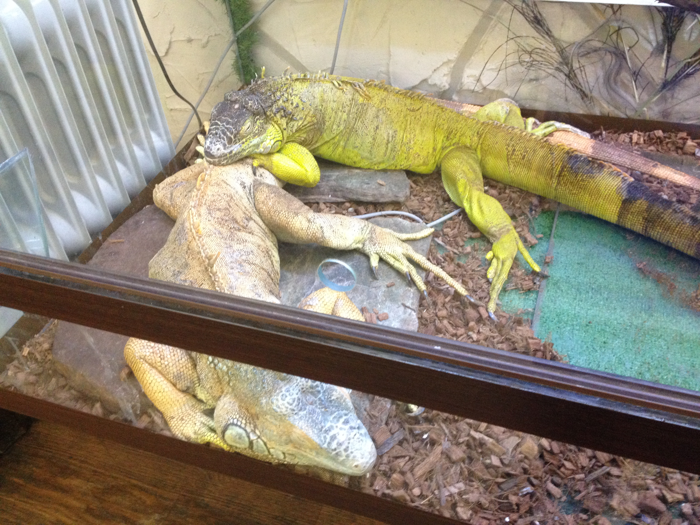

# Инструкция для работы с Marcdown

## Выделение текста

* чтобы выделить текст курсивом необходимо обрамить его звёздочками (*).Например *вот так*

* чтобы выделить текст полужирым необходимо обрамить его двойными звёздочками (**) например **вот так**

## Списки

Чтобы добавить ненумерованные списки необходимо пункты выделить звёздочкой (*). Например, вот так:

* Элемент 1
* Элемент 2
* Элемент 3

Чтобы добавить нумерованные списки необходимо пункты просто пронумеровать. Например вот так:

1. Первый пункт
2. Второй пункт

## Работа с изображениями

Чтобы вставить изображение в текст, достаточно написать следующее:

## Ссылки

## Работа с таблицами

## Цитаты

## Заключение
